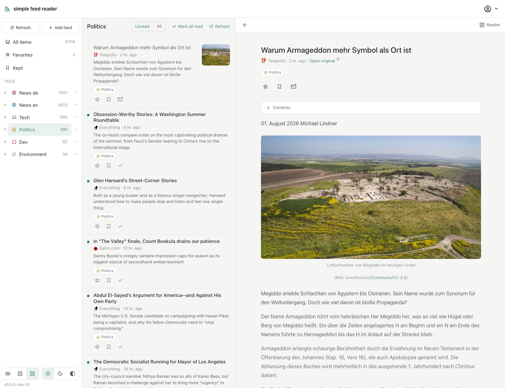
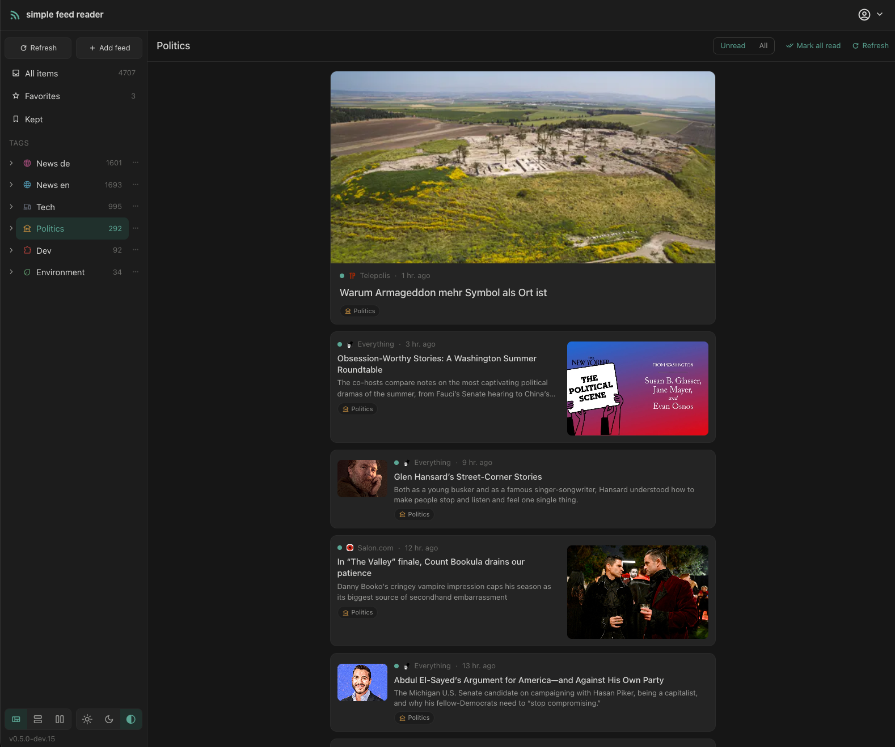
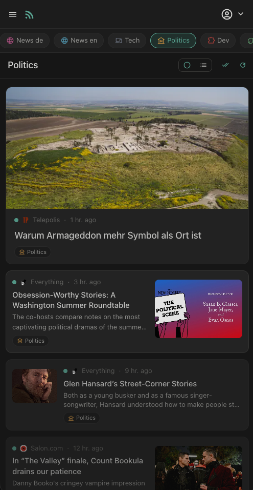

# simple-feed-reader

[](https://github.com/larspohlmann/simple-feed-reader/actions/workflows/ci.yml)

A multi-user RSS/Atom feed reader. Symfony 7.4 LTS JSON API in `backend/`, with
the Angular 20 SPA that delivers the reader UI and auth in `frontend/`.



<p>
  
  
</p>

## Run it (Docker)

Run your own instance with one command. You need
[Docker](https://docs.docker.com/get-docker/) (running) and
[git](https://git-scm.com/downloads). Then:

```bash
curl -fsSL https://raw.githubusercontent.com/larspohlmann/simple-feed-reader/main/scripts/install.sh | bash
```

The installer clones the project into `./simple-feed-reader`, checks out the
latest release, generates the secrets it can, asks for the things only you
know (how users reach the instance — plain HTTP, your own certificate, or a
reverse proxy — under which hostname and port, and how to send mail), and
starts the production stack. The full guide — TLS, reverse proxies, mail verification, backups —
is [docs/docker-production.md](docs/docker-production.md).

> **Read before you pipe to bash.** You can inspect exactly what runs at
> [scripts/install.sh](scripts/install.sh). The installer never deletes data.

### Developing

For the development stack — live-reloading frontend, xdebug, and
[Mailpit](https://mailpit.axllent.org/) catching all outgoing mail locally —
use the dev installer instead (it additionally needs
[mkcert](https://github.com/FiloSottile/mkcert#installation)):

```bash
curl -fsSL https://raw.githubusercontent.com/larspohlmann/simple-feed-reader/main/scripts/install-dev.sh | bash
```

The manual walkthrough lives in [docs/local-docker.md](docs/local-docker.md).

### Everyday scripts

Run these from inside the `simple-feed-reader` directory:

| Task | Command |
|---|---|
| Update to the latest release (prod and/or dev) | `./scripts/update.sh` |
| Start / stop the production stack | `./scripts/prod-start.sh` / `./scripts/prod-stop.sh` |
| Change the public origin / mail settings | `./scripts/prod-configure.sh` |
| Start / stop the dev frontend (:4200) | `./scripts/frontend-start.sh` / `./scripts/frontend-stop.sh` |
| Stop the dev stack (keeps your data) | `docker compose down` |

## Documentation

- [Frontend workspace](frontend/README.md) — the Angular 20 SPA: dev server, the
  quality gate, theming, and the bearer-token auth model.
- [Architecture: client contract and native-client readiness](docs/architecture.md)
  — the cross-cutting rules for how clients talk to the backend, and the standing
  constraint that keeps a future native iOS app viable.
- [OAuth sign-in (Google and Apple)](docs/oauth-sign-in.md) — provider setup for
  operators, and the redirect/exchange contract for the SPA.
- [Local Docker environment](docs/local-docker.md) — run the whole stack
  (MySQL, PHP, nginx with TLS, Mailpit) in Docker.
- [How a "For you" run works](docs/recommendations-runs.md) — what happens
  after "Get recommendations", closing the browser, stopping, resuming.
- [Running in production (Docker)](docs/docker-production.md) — the prod
  stack: MySQL or SQLite, real mail transport, TLS or reverse proxy, updates,
  backups.
- **First-run setup:** creating the initial admin — see [docs/first-run-setup.md](docs/first-run-setup.md).
- [Cutting a release](docs/releasing.md) — how a `vX.Y.Z` tag on `main` becomes
  the version the install and update scripts hand to users.
- [Design spec](docs/superpowers/specs/2026-07-21-simple-feed-reader-design.md)
- [Implementation plans](docs/superpowers/plans/)
- [Contributing](CONTRIBUTING.md) — issue-first workflow, branch conventions,
  and the quality gate. Licensed under the [MIT license](LICENSE); notable
  changes land in the [changelog](CHANGELOG.md).
