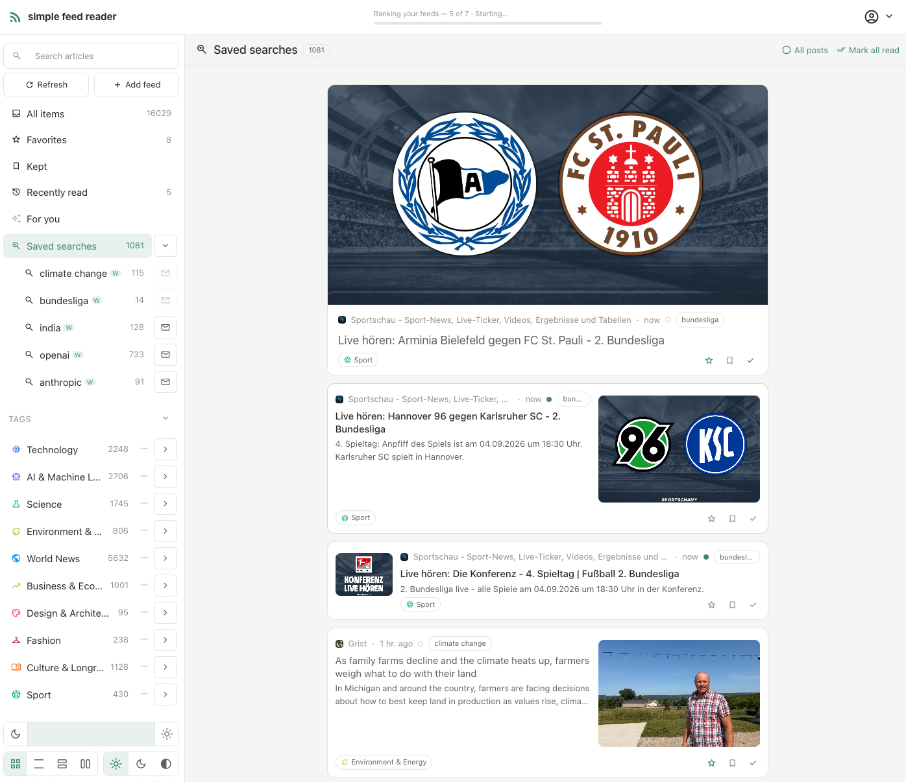
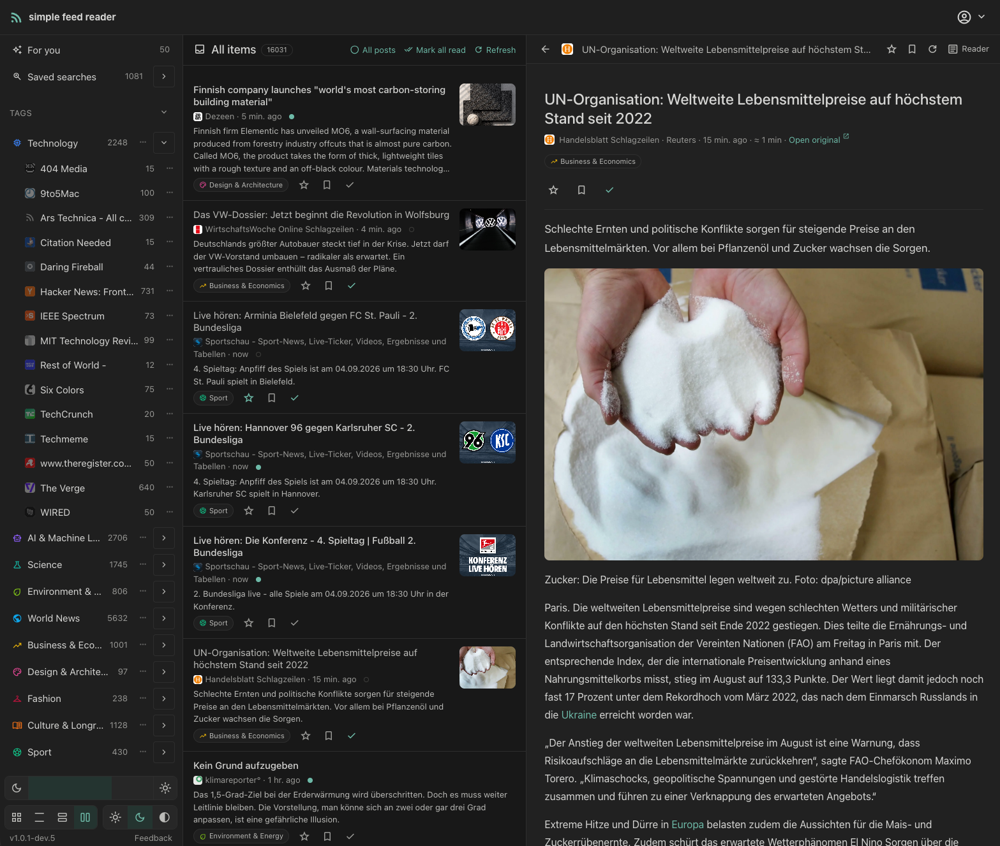
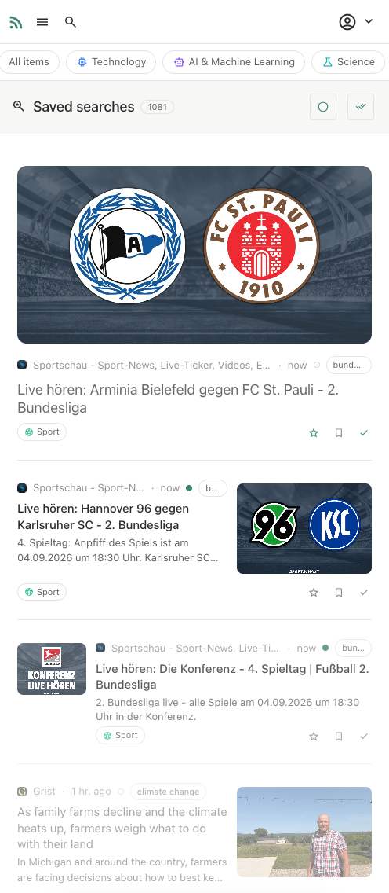
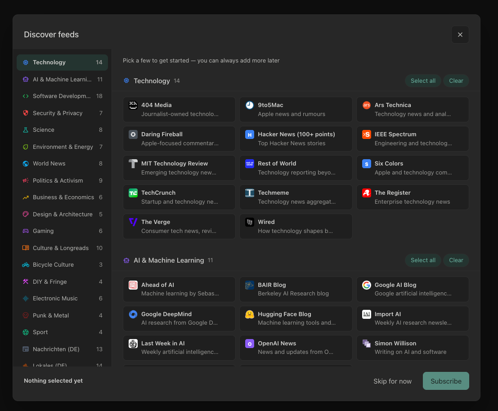
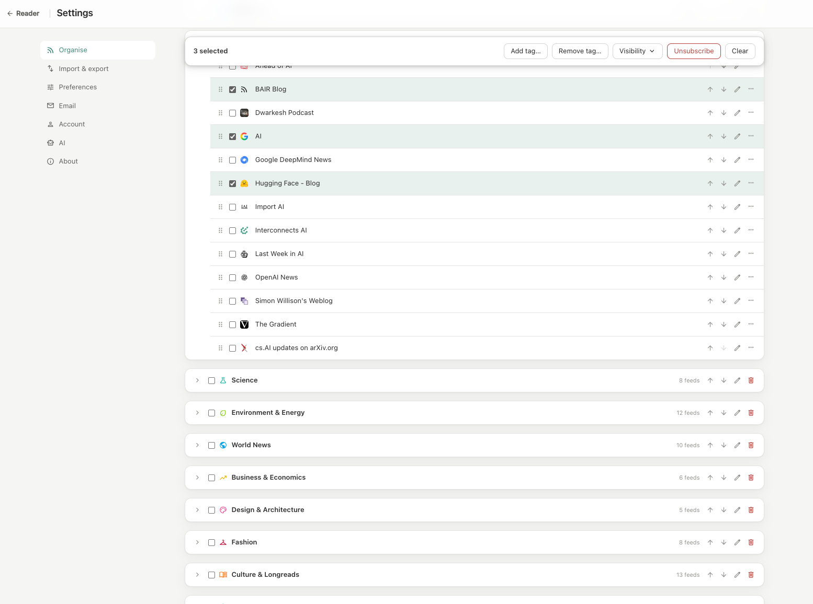

# simple-feed-reader

[](https://github.com/larspohlmann/simple-feed-reader/actions/workflows/ci.yml)

A web-based RSS/Atom feed reader you run yourself — for you alone or for
several users. Free and open source (MIT).



<p>
  
  
</p>

<p>
  
  
</p>

More in the [screenshot gallery](docs/screenshots.md).

## Features

**Reading**

- Three layouts: a magazine-style card grid, a compact list, and a two-pane
  view — with a draggable split — that shows the article next to the entry list.
- Reader view shows the extracted full article text, with images, audio, and
  video (including streaming video) played inline; you can switch to the feed's
  own version at any time, or open the original page. If the text is only the
  free preview of a paywalled article, the reader tells you.
- Read/unread tracking with "mark all read", favorites, and a separate
  "keep" list.
- Full-text search across your articles, including exact phrases in quotes.
  Save a search as a named view in the sidebar, each with its own unread
  count — open one, or open all as a combined list.
- Email digests: a daily or weekly summary of new articles from the saved
  searches you choose.
- Reading-time estimates, a progress bar, and an optional reading focus that
  dims everything but the passage in front of you.

**Feeds**

- Add a feed by its address — or paste the website's address and the app
  finds the feed for you.
- Preview a feed before you subscribe: recent items, whether entries carry
  images, and whether the feed delivers full text or only summaries.
- Import and export your subscriptions as OPML.
- Feed health is visible in the settings — active, erroring, or gone, with a
  plain-language explanation.
- An Organise page gathers every feed and tag in one place: reorder them by
  drag, select several at once to tag them or change their visibility in bulk,
  and retry or unsubscribe feeds that are erroring or gone.
- For sites without any feed, an opt-in experimental mode scrapes the
  article list into a pseudo-feed.
- When a WordPress site's feed carries only summaries, the app detects its
  REST API while finding the feed and offers it as a richer alternative —
  full article text, chosen in the same subscribe dialog.

**Tags**

- Group feeds with tags; each tag has a name, a color, and an icon.
- Assign tags in the feed dialog, or drag a feed onto a tag.
- Unread counts per feed and per tag.

**"For you" — AI recommendations (optional)**

- A ranked selection of your unread articles, based on what you favorite,
  keep, and read.
- You choose the provider: any OpenAI-compatible API works, including local
  models via LM Studio or Ollama — your data can stay on your own machine.
- A free-text guidance prompt steers the picks (topics to prefer or avoid);
  runs start manually or on a schedule.
- Runs execute on the server: close the tab and come back later, stop a run,
  or resume a failed one.
- A cost overview shows token usage and cost per run, spend per month, and
  the total spent — so there are no surprises with paid providers.

**Accounts**

- Sign in with email and password, with Google or Apple, or with a passkey.
- Email verification and admin approval for new accounts are optional — you
  decide per instance.
- Registration is protected by an invisible proof-of-work challenge; there is
  no CAPTCHA to solve.
- Users can export the whole account to a backup file and restore it later, or
  delete the account entirely, including all its data.

**Administration**

- Most instances are self-hosted, so you are the admin: approve, suspend, or
  delete users from the settings.
- Optional trial periods and per-user feed limits.
- Configure outgoing mail (SMTP) from the admin settings, with a built-in
  connection test.
- Route the server's outbound fetches through an HTTP proxy, set and tested
  from the admin settings.
- A feed catalog suggests feeds to new users; edit it or import the bundled
  one.

**Interface**

- Special effort went into mobile: a collapsible sidebar with swipe gestures,
  pull-to-refresh, and touch-friendly controls.
- Light and dark themes, following your system setting if you want.
- The interface is available in English and German.

## Run it (Docker)

Run your own instance with one command. You need
[Docker](https://docs.docker.com/get-docker/) (running) and
[git](https://git-scm.com/downloads). Then:

```bash
curl -fsSL https://raw.githubusercontent.com/larspohlmann/simple-feed-reader/main/scripts/install.sh | bash
```

The installer clones the project into `./simple-feed-reader`, checks out the
latest release, generates the secrets it can, asks for the things only you
know (which package to install, how users reach the instance — plain HTTP,
your own certificate, or a reverse proxy — under which hostname and port, and
how to send mail), and starts the production stack. The full guide — TLS,
reverse proxies, mail verification, backups —
is [docs/docker-production.md](docs/docker-production.md).

> **Read before you pipe to bash.** You can inspect exactly what runs at
> [scripts/install.sh](scripts/install.sh). The installer never deletes data.

### Which package

The first question the installer asks is which package to install. It decides
the database and the search engine together, because the two of them are what
the stack costs in memory:

| Package | What you get | Containers | RAM |
|---|---|---|---|
| **S** | a personal instance. SQLite, title and summary search. | php, worker, web | needs about 250 MB |
| **M** | several users. MySQL, title and summary search. | php, worker, web, mysql | needs about 1 GB |
| **L** | like M, plus Meilisearch for full-content search. | php, worker, web, mysql, meilisearch | needs about 2.5 GB |

Every package runs the same application, with every feature: they differ in
the containers beside it, not in what the reader can do. **Search works in all
three.** S and M answer it from the database, which matches titles and
summaries; L adds a Meilisearch container that matches the full text of every
article as well.

Two more keys decide how much you are asked, rather than what runs:

- **Q** — the quick install, and **the default**. It runs the S stack and asks
  nothing else, which is what the question itself says under it:
  *It picks http://localhost:3333, and no mail until you add a relay.*
  Press return at the first question and the instance comes up. The public URL
  and mail are changeable afterwards with `./scripts/prod-configure.sh`; the
  database is not.
- **C** — choose everything yourself, database and engine included. S, M and L
  ask for the public URL and for the mail transport anyway — an SMTP relay
  (host, port, user, password) or the MTA on this machine, which the app needs
  before it can send verification, password-reset and approval mail. Without
  one it sends none, which is the default and a complete answer for a private
  instance. C adds the database and the search-engine questions to those,
  which makes it the only way to reach a combination the three packages do not
  cover, such as SQLite with a search engine.

The figures are measured on an idle, healthy stack holding a real account of
107 feeds and 17,427 articles. S and M do not grow with the number of
articles; L adds roughly 45 MB per 1,000 articles on top of its base.

Both installers take a target directory and `--ref <branch-or-tag>`, which
installs something other than the latest release — how a change is tried on a
test instance before it ships:
`… | bash -s -- --ref feature/430-installer-output my-folder`.

Every script in the table below, and both installers, print `--help`.

Once the stack is running, create the first administrator account — see
[docs/first-run-setup.md](docs/first-run-setup.md).

### Everyday scripts

Run these from inside the `simple-feed-reader` directory:

| Task | Command |
|---|---|
| Update to the latest release (prod and/or dev) | `./scripts/update.sh` |
| Update to a branch or tag instead | `./scripts/update.sh --ref <branch-or-tag>` |
| Start / stop the production stack | `./scripts/prod-start.sh` / `./scripts/prod-stop.sh` |
| Change the public origin / mail settings | `./scripts/prod-configure.sh` |
| Start / stop the dev frontend (:4200) | `./scripts/frontend-start.sh` / `./scripts/frontend-stop.sh` |
| Stop the dev stack (keeps your data) | `docker compose down` |

## For developers

A multi-user RSS/Atom feed reader. Symfony 7.4 LTS JSON API in `backend/`, with
the Angular 20 SPA that delivers the reader UI and auth in `frontend/`.

### Developing

For the development stack — live-reloading frontend, xdebug, and
[Mailpit](https://mailpit.axllent.org/) catching all outgoing mail locally —
use the dev installer instead (it additionally needs
[mkcert](https://github.com/FiloSottile/mkcert#installation)):

```bash
curl -fsSL https://raw.githubusercontent.com/larspohlmann/simple-feed-reader/main/scripts/install-dev.sh | bash
```

The manual walkthrough lives in [docs/local-docker.md](docs/local-docker.md).

### Documentation

- [Frontend workspace](frontend/README.md) — the Angular 20 SPA: dev server, the
  quality gate, theming, and the bearer-token auth model.
- [Architecture: client contract and native-client readiness](docs/architecture.md)
  — the cross-cutting rules for how clients talk to the backend, and the standing
  constraint that keeps a future native iOS app viable.
- [OAuth sign-in (Google and Apple)](docs/oauth-sign-in.md) — provider setup for
  operators, and the redirect/exchange contract for the SPA.
- [Local Docker environment](docs/local-docker.md) — run the whole stack
  (MySQL, PHP, nginx with TLS, Mailpit) in Docker.
- [How a "For you" run works](docs/recommendations-runs.md) — what happens
  after "Get recommendations", closing the browser, stopping, resuming.
- [Account backup and restore](docs/backup.md) — what a backup file carries,
  what it deliberately drops, and what a restore does to the account.
- [Running in production (Docker)](docs/docker-production.md) — the prod
  stack: MySQL or SQLite, real mail transport, TLS or reverse proxy, updates,
  backups.
- **First-run setup:** creating the initial admin — see [docs/first-run-setup.md](docs/first-run-setup.md).
- [Cutting a release](docs/releasing.md) — how a `vX.Y.Z` tag on `main` becomes
  the version the install and update scripts hand to users.
- [Design spec](docs/superpowers/specs/2026-07-21-simple-feed-reader-design.md)
- [Implementation plans](docs/superpowers/plans/)
- [Contributing](CONTRIBUTING.md) — issue-first workflow, branch conventions,
  and the quality gate. Licensed under the [MIT license](LICENSE); notable
  changes land in the [changelog](CHANGELOG.md).
