# Screenshots

A tour of simple-feed-reader. Every surface works in a light and a dark theme.

[← Back to the README](../README.md)

## The magazine card grid

The default layout, with the sidebar of feeds, tags, and saved searches.

## The two-pane view

The entry list on the left, the article next to it. Reader view shows the
extracted full text; you can switch to the feed's own version or open the
original page.

## The card grid on mobile

The grid collapses to a single column on a phone.

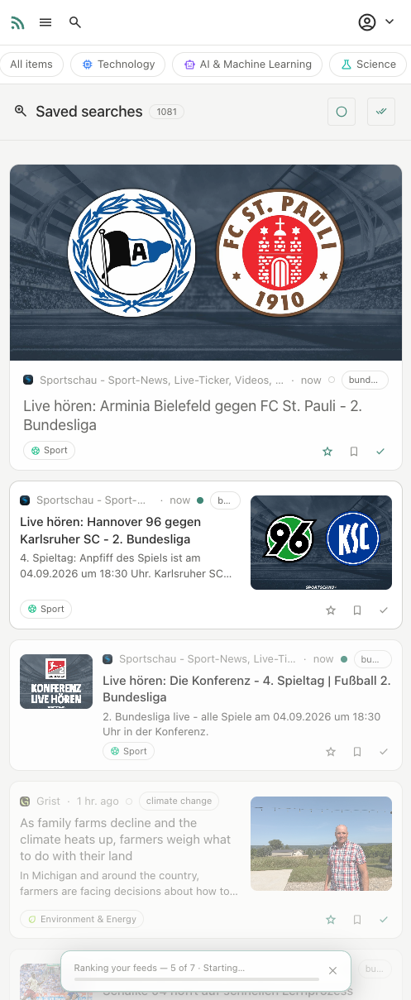

The same view in the dark theme.

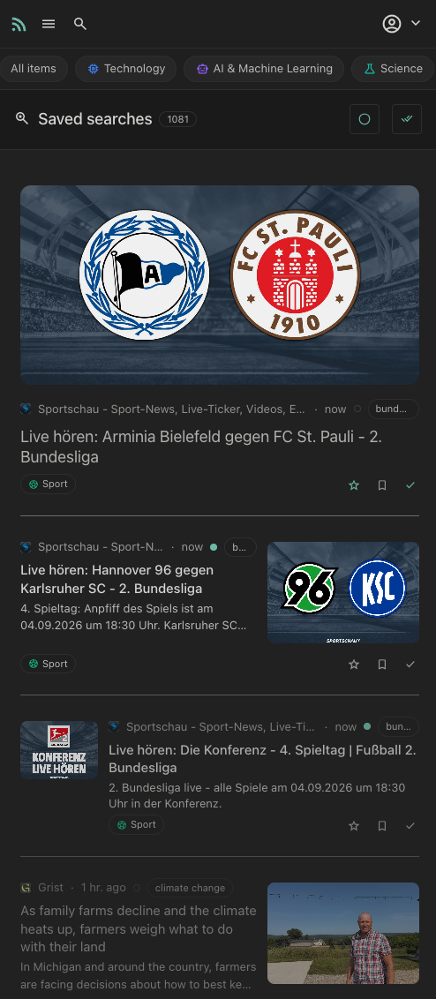

## The reader view

The extracted article, with a reading-time estimate and a link to the original.

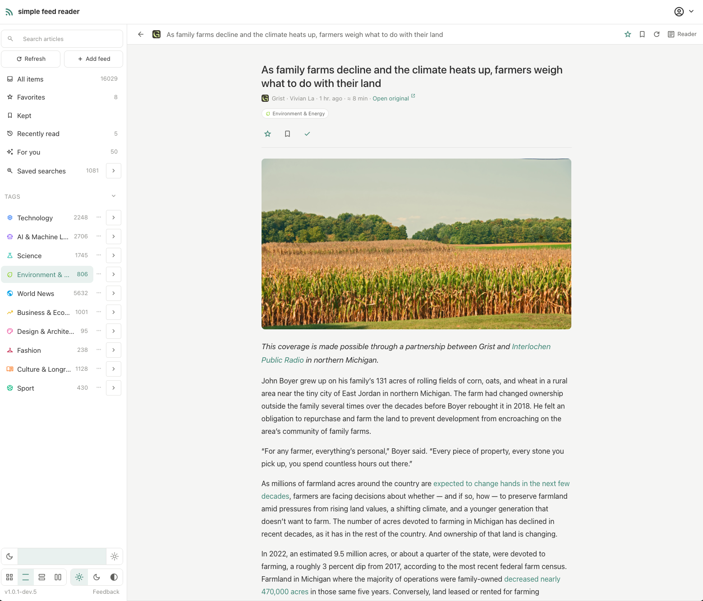

## "For you"

An optional personal feed. An AI model ranks your unread entries and can show a
short reason and a score for each pick.

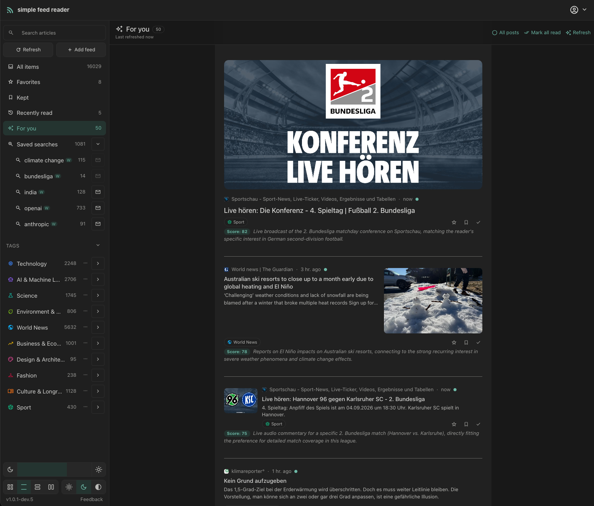

## Guided feed discovery

On first run, pick from a curated catalog by topic — or skip it and add your own.

## The email digest

An optional email groups new entries that match your saved searches.

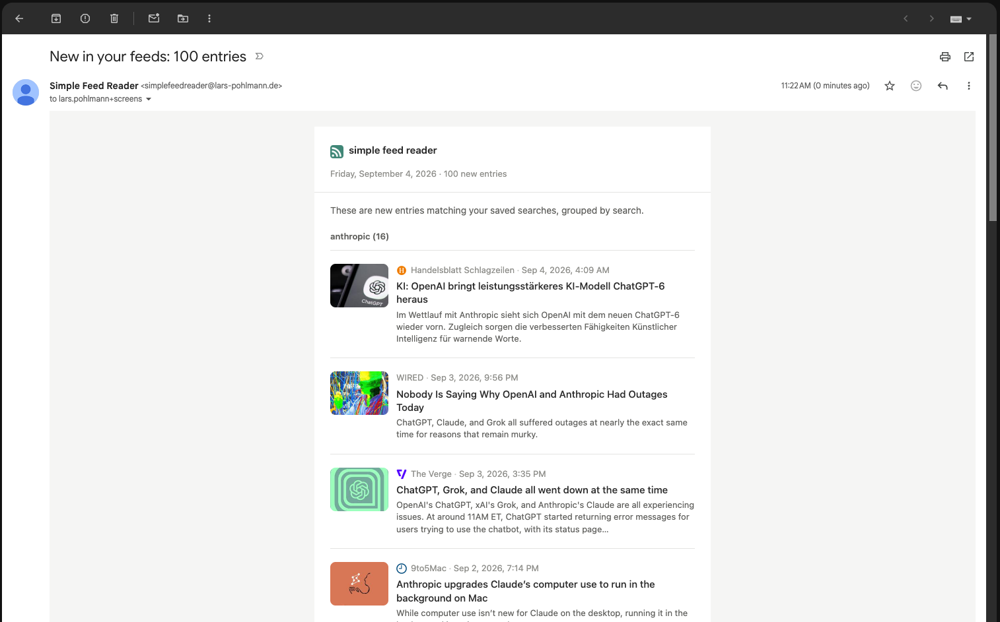

## Organise your feeds

Drag to reorder, tag in bulk, and change visibility.

## Sign in

Sign in with a password, a passkey, or an identity provider (Apple, Google).

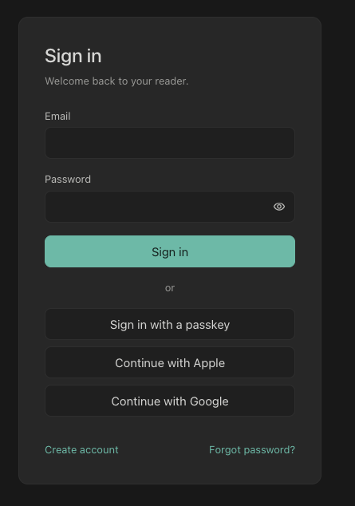

## AI recommendation settings

Choose the provider and control how the "For you" feed is built.

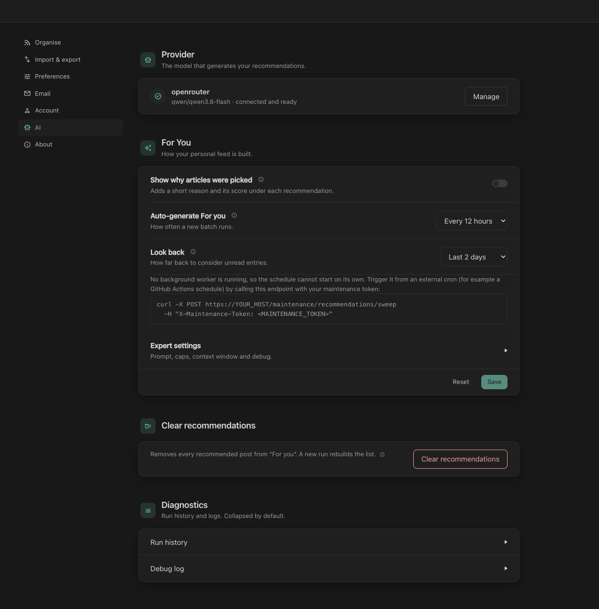

## Email digest settings

Set the frequency, format, and which saved searches the digest includes.

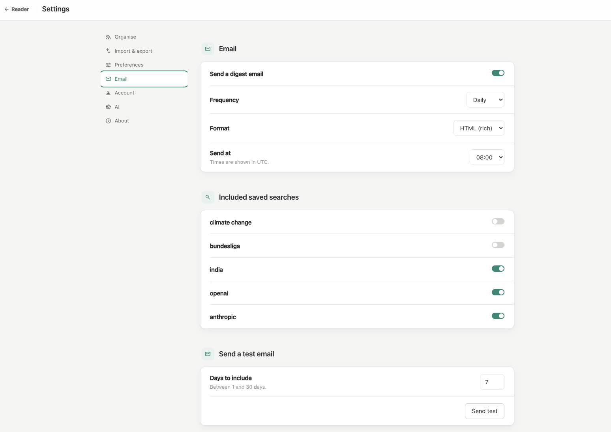

## Account and passkeys

Manage your account and register passkeys.

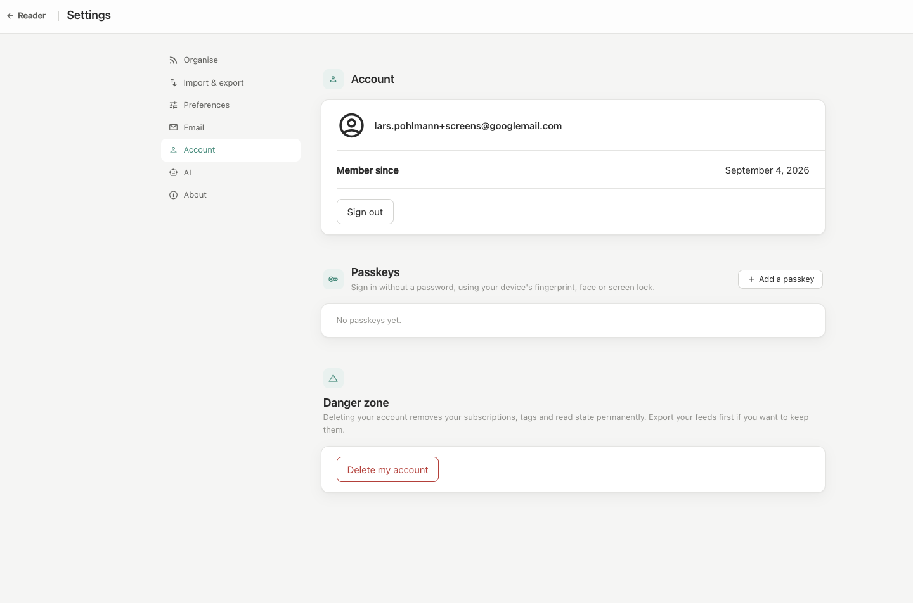

## Administration — users

Per-user status, roles, footprint, and limits.

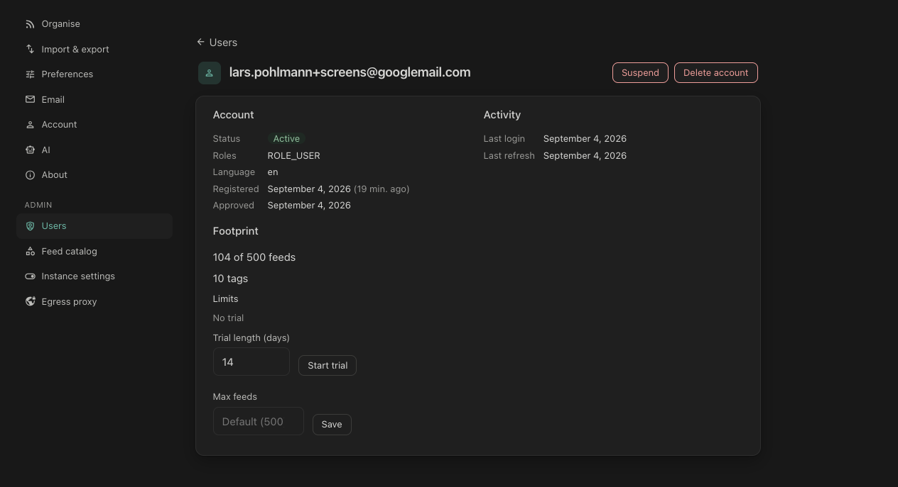

## Administration — instance settings

The sign-up policy, the public base URL, and the passkey domain.

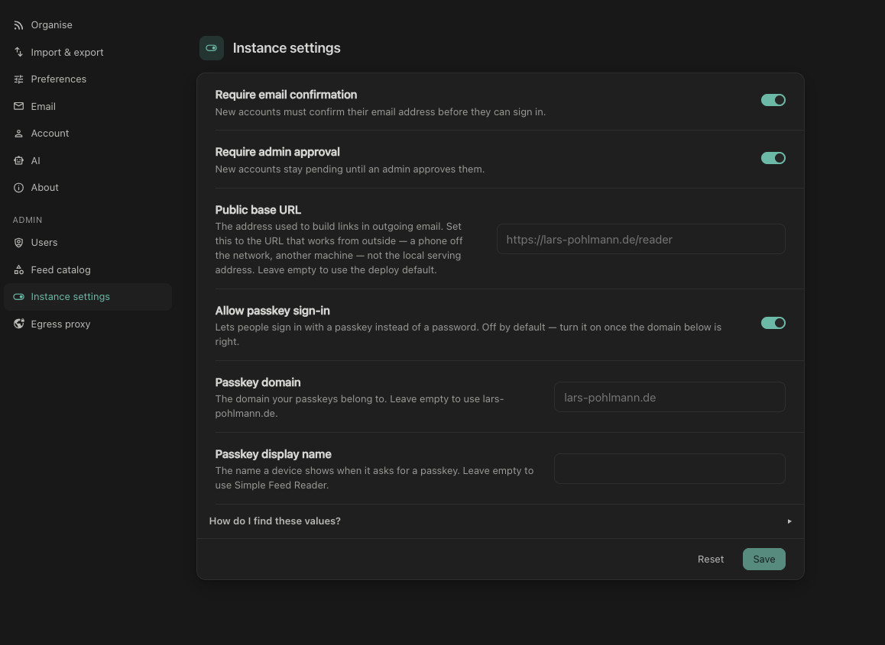

## Administration — egress proxy

Route feed and article fetches through a SOCKS5 or HTTP proxy.

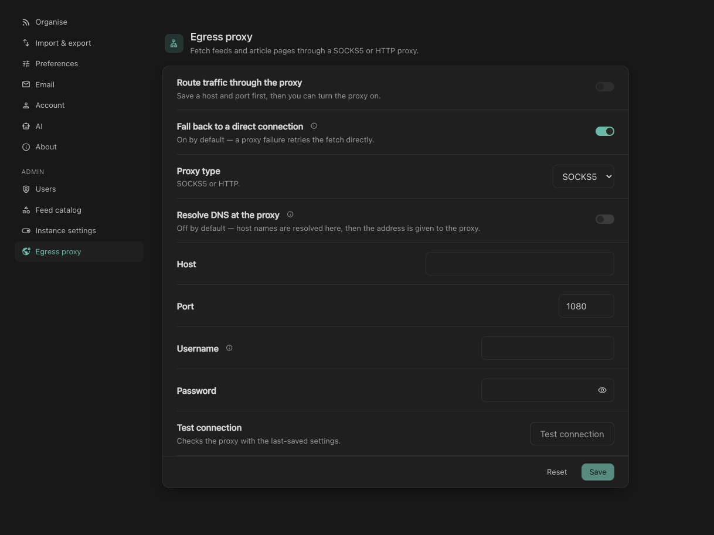
